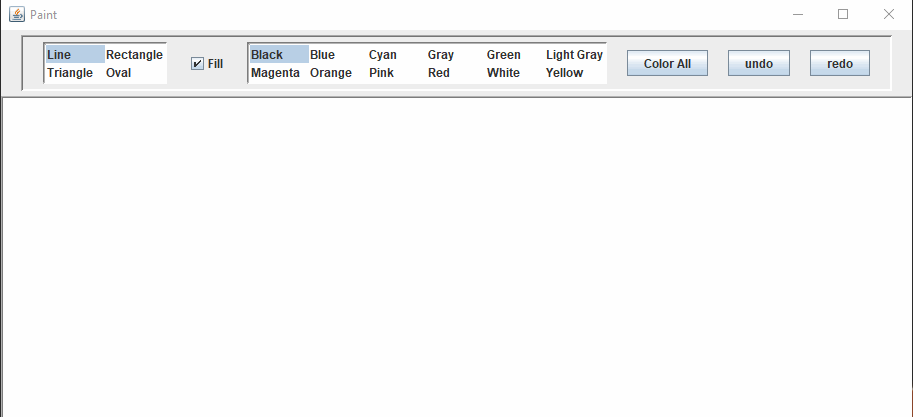

# Paint(OOP_Project)
A simple paint project using Java and swing API to apply OOP and design patterns concepts
## Design patterns covered :
- Observer
- Singleton
- Memento
- Factory
- Prototype
- Composite
## Demo
To test the project run (Paint\src\OOPPaint\Test.java)

## Usefull links
- [tutorialspoint/design_pattern](https://www.tutorialspoint.com/design_pattern/index.htm)
